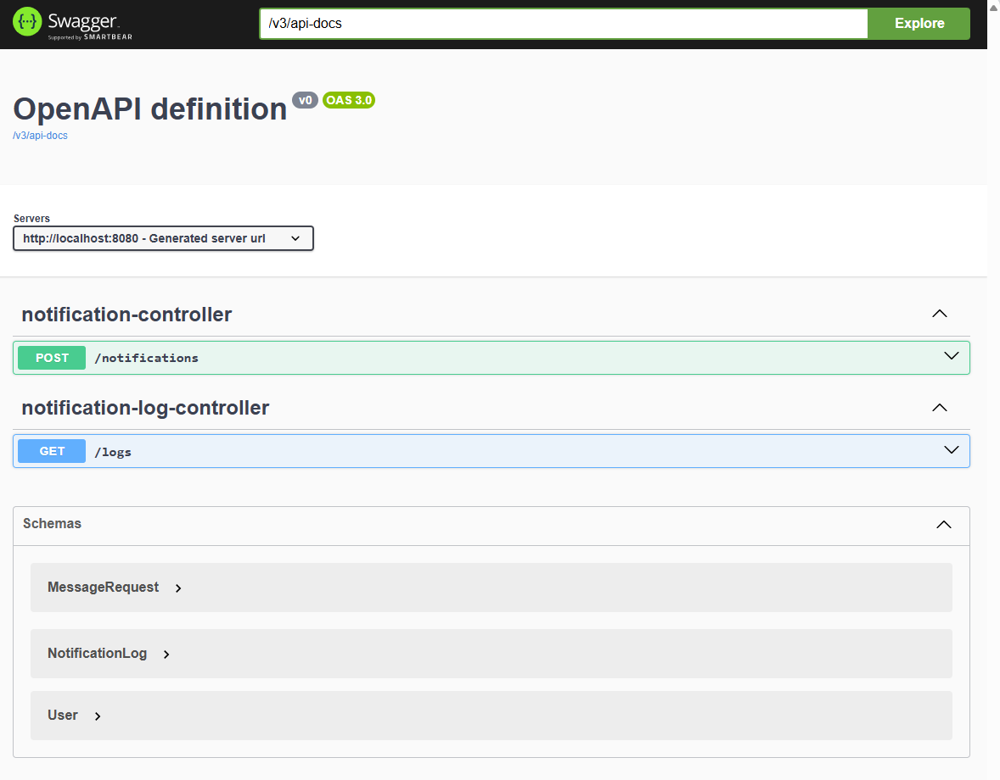
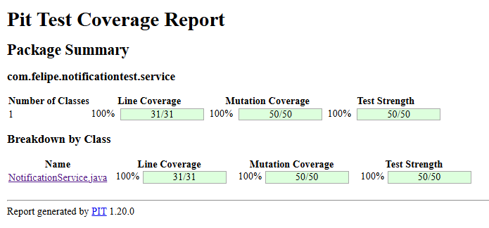

# Notification Service - Backend

This is the backend of a technical challenge project that simulates a basic notification system. It’s built with **Java 21** and **Spring Boot 3**, using **PostgreSQL** as the database and **Flyway** for schema migrations.

The core functionality is to receive messages and deliver them to users based on their subscribed categories and preferred channels (Email, SMS, Push Notification, etc). All deliveries are logged with their status.

---

## Tech Stack

- Java 21
- Spring Boot 3.x
- PostgreSQL
- JPA & Hibernate
- Flyway
- Docker & Docker Compose
- Lombok
- Swagger / OpenAPI
- JUnit 5, PITEST & Mockito

---

## Project Structure

```

src/
├── main/
│   ├── java/
│   │   └── com.felipe.notificationtest
│   │       ├── controller/
│   │       ├── service/
│   │       ├── strategy/
│   │       ├── model/
│   │       ├── repository/
│   │       └── dto/
│   └── resources/
│       ├── application.properties
│       └── db/migration/
└── test/

````

---

## How to Run

### 1. Start PostgreSQL with Docker:

```bash
docker-compose up -d
````

This will create a PostgreSQL container with the database `notificationdb`.

### 2. Run the application:

```bash
./mvnw spring-boot:run
```

The backend will start on [http://localhost:8080](http://localhost:8080).

---

## Features

* Users have:

    * Subscribed categories (e.g., SPORTS, FINANCE)
    * Preferred notification channels (e.g., EMAIL, SMS)

* Messages are:

    * Sent to all users subscribed to the message’s category
    * Delivered through each user’s preferred channels
    * Logged with timestamp and status (SUCCESS / FAILURE)

* Easily extendable to support new channels using the Strategy pattern

---

## API Documentation

Once the application is running, Swagger UI is available at:

```
http://localhost:8080/swagger-ui.html
```



---

## Tests

Run unit and integration tests with:

```bash
./mvnw test
```
## Mutation Testing

Mutation tests are included using [PITEST](https://pitest.org/).



### Run tests:
```bash
./mvnw org.pitest:pitest-maven:mutationCoverage
```

Report:
Open the generated HTML in:
target/pit-reports/index.html

---

## Future Improvements

* Add real integration with external services (e.g., email/SMS providers)
* Improve error handling with specific response messages
* Rate limiting
* Add authentication layer (e.g., JWT)


Developed by Felipe Azevedo as part of a technical challenge.
